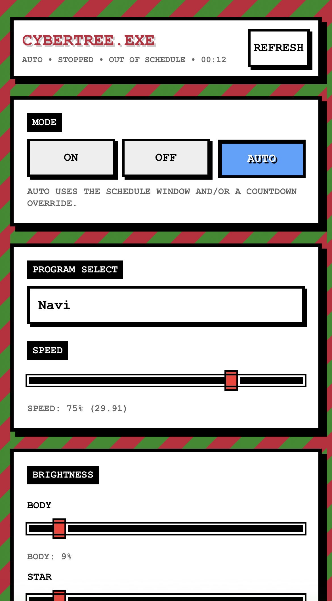

# RGB Christmas Tree Controller

Control your 3D RGB Christmas Tree from your phone. This project gives you a web-based remote control (think "CyberTree.EXE") that runs on a Raspberry Pi and lets you:

- Choose from 15+ built-in light patterns (candles, snowfall, candy cane, rainbow snake, and more)
- Control brightness and animation speed
- Set a daily schedule so your tree turns on and off automatically
- Use countdown timers for "stay on for 2 more hours" scenarios
- Access everything from your phone's browser on your home network

The whole thing runs automatically when your Raspberry Pi boots up, so you can just plug it in and forget about it.



## What You'll Need

- A **3D RGB Xmas Tree** from [The Pi Hut](https://thepihut.com/products/3d-rgb-xmas-tree-for-raspberry-pi) or similar
- A **Raspberry Pi** (any model that fits the tree will work)
- A **microSD card** with fresh Raspberry Pi OS installed
- Your Pi connected to your home Wi-Fi

That's it. No soldering, no electronics knowledge required.

## Installation Guide

This guide assumes you're starting with a fresh Raspberry Pi OS installation. If you're comfortable with the terminal, this should take about 5-10 minutes.

### Step 1: Connect to your Raspberry Pi

SSH into your Pi or open a terminal window if you're using it with a keyboard and monitor:

```bash
ssh pi@<your-pi-ip-address>
```

(Or use your Pi's hostname if you prefer)

The default password is usually `raspberry` (but you should change it).

### Step 2: Install git

If git isn't already installed:

```bash
sudo apt update
sudo apt install -y git
```

### Step 3: Download this project

Clone this repository to your home directory:

```bash
cd ~
git clone https://github.com/hogg101/rgbxmastree
cd rgbxmastree
```

### Step 4: Run the setup script

This script installs everything and sets up the tree to start automatically when your Pi boots:
First, make the script executable:
'''bash
chmod +x scripts/setup_pi.sh
'''
Then run the script:
```bash
sudo ./scripts/setup_pi.sh
```

The script will:
- Install Python dependencies
- Copy everything to `/opt/rgbxmastree`
- Set up a system service that starts on boot
- Start the tree controller and web interface

### Step 5: Open the web interface

On your phone or computer (connected to the same Wi-Fi), open your browser and go to your Pi's IP address (or hostname):

```
http://192.168.1.XXX:8080
```

(Find your Pi's IP address by running `hostname -I` on the Pi or by using a network scanner or using your router's admin interface)

### Step 6: Enjoy!

You should now see the **CyberTree.EXE** interface. Try switching between programs, adjusting the brightness, and setting up your daily schedule.

## Updating the Software

If you want to pull in new light patterns or bug fixes:

```bash
cd ~/rgbxmastree
git pull
sudo ./scripts/update_pi.sh
```

This will update the code and restart the tree service.

## Checking Status

Want to see if the service is running properly?

```bash
sudo systemctl status rgbxmastree.service --no-pager
```

To restart it manually:

```bash
sudo systemctl restart rgbxmastree.service
```

## Available Light Programs

The tree comes with these built-in patterns:

- **Candles** - Flickering warm candlelight effect
- **Snowfall** - Gentle falling snow
- **Candy Cane** - Classic red and white stripes
- **Holly Jolly** - Festive red and green patterns
- **Silent Night** - Calm, peaceful blue tones
- **Vintage Lights** - Old-school Christmas lights with a warm glow
- **Fireplace** - Cozy fire effect
- **Rainbow Snake** - Rainbow colors spiraling around the tree
- **Matrix Rain** - Digital rain effect (for the nerds)
- **Navi** - Blue fairy-like sparkles
- **Police Lights** - Red and blue flashing (hey, not everything has to be Christmas)
- **Radar Scan** - Rotating scan effect
- Plus several legacy patterns from the original project

Speed control lets you make them faster or slower, and you can adjust the brightness of the tree body and star separately.

## Troubleshooting

**Can't access the web interface?**
- Make sure your phone/computer is on the same Wi-Fi network as the Pi
- Double-check your Pi's IP address with `hostname -I`
- Check if the service is running: `sudo systemctl status rgbxmastree.service`

**Tree isn't lighting up?**
- Make sure the tree is properly seated on the Pi's GPIO pins and the right way around
- Try restarting the service: `sudo systemctl restart rgbxmastree.service`
- Check that the Pi is powered properly (some trees draw a lot of current)

---

## For Developers and Tinkerers

Everything below this point is for people who want to modify the code, write their own light patterns, or understand how the hardware works. If you just want to use the tree, you're already done.

### Writing Your Own Light Programs

Want to create custom light patterns? Check out the `rgbxmastree/programs/PROGRAM_GUIDE.md` file for a complete guide.

Quick example:

```python
from rgbxmastree.hardware.tree import RGBXmasTree
from colorzero import Color

tree = RGBXmasTree()
tree.color = Color("red")  # Set entire tree to red
```

All programs live in `rgbxmastree/programs/` and are automatically discovered by the web interface.

### Hardware Details: Tree Structure

The tree hardware has:
- **3 levels** of branches (0=bottom, 1=middle, 2=top)
- **8 branches** per level (arranged in a circle, 0-7)
- **1 star** on top

### Accessing Individual Pixels

```python
from rgbxmastree.hardware.tree import RGBXmasTree
from colorzero import Color

tree = RGBXmasTree()

# Access by level and branch
tree[0, 0].color = Color("green")  # Bottom level, first branch
tree[1, 3].color = Color("red")    # Middle level, fourth branch

# Access the star
tree.star.color = Color("yellow")

# Set all pixels at once
tree.color = Color("white")

# Iterate through all pixels
for pixel in tree:
    pixel.color = Color("blue")
```

If you position the tree so the Raspberry Pi faces you, branch 0 is at the "front" and counts clockwise around the tree.

### Batching Updates for Better Performance

By default, each color change updates the LEDs immediately. For smoother animations that update many pixels at once, use batched mode:

```python
tree.auto_show = False  # Disable auto-update

# Make multiple changes
for level in range(3):
    for branch in range(8):
        tree[level, branch].color = (0.0, 0.0, 1.0)  # Blue
tree.star.color = (1.0, 1.0, 1.0)  # White

tree.show()  # Update all LEDs at once
tree.auto_show = True  # Re-enable auto-update
```

### Brightness Control

Brightness is controlled separately for the tree body and star. The hardware uses values 0-31:

```python
tree.body_brightness = 8   # Dim body
tree.star_brightness = 2   # Very dim star
```

The web interface converts this to a percentage (0-100%) for user-friendliness.

### Project Structure

- `rgbxmastree/hardware/tree.py` - Low-level hardware driver
- `rgbxmastree/programs/` - All light pattern implementations
- `rgbxmastree/web/` - Flask web server and interface
- `rgbxmastree/controller.py` - Program switching and state management
- `rgbxmastree/scheduler.py` - Daily schedule and countdown timer logic
- `scripts/` - Installation and update scripts

---

**Built by [James Hogg](https://jameshogg.tech) ([@hogg101](https://github.com/hogg101))** - Based on the original [3D RGB Xmas Tree examples](https://github.com/ThePiHut/rgbxmastree) from The Pi Hut.

## License

This project is licensed under the MIT License - see the [LICENSE](LICENSE) file for details.
